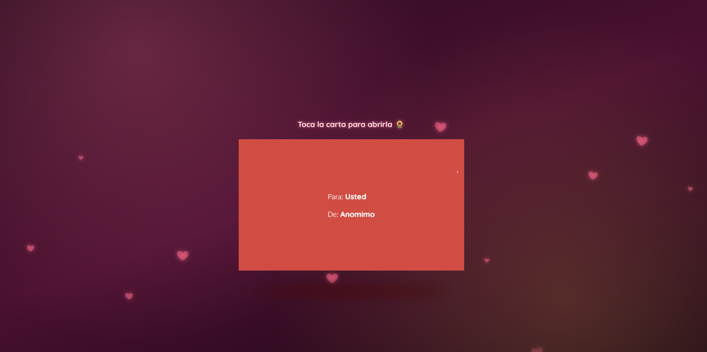
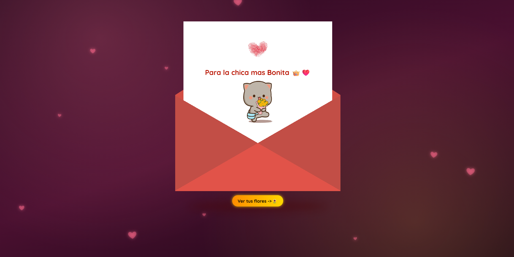

<div align="center">

# 🌻 Flores Amarillas

**Una carta de amor digital con un jardín de girasoles animado.**





</div>

---

## Tabla de contenidos

1. [Descripción](#descripción)
2. [Características](#características)
3. [Tecnologías](#tecnologías)
4. [Estructura del proyecto](#estructura-del-proyecto)
5. [Primeros pasos](#primeros-pasos)
6. [Personalización](#personalización)
7. [Despliegue](#despliegue)
8. [Compatibilidad](#compatibilidad)
9. [Autor](#autor)

## Descripción

Proyecto web estático de dos pantallas pensado como regalo digital. La primera muestra un sobre en 3D que se abre al tocarlo y revela un mensaje personalizado. La segunda es un jardín nocturno con girasoles animados, estrellas fugaces y música de fondo.

No usa frameworks, dependencias ni proceso de compilación: basta con abrir los archivos en un navegador o publicarlos en cualquier hosting estático.

## Características

| Pantalla | Qué incluye |
|---|---|
| **Carta** (`index.html`) | Sobre animado en 3D · mensaje y personaje animado sin fondo · fondo romántico con corazones flotantes · música que inicia al abrir · aviso "Toca la carta para abrirla" · botón hacia el jardín |
| **Jardín** (`jardin.html`) | 5 girasoles animados · hierba que crece · estrellas fugaces aleatorias · música ambiental con botón de pausa · flores ampliadas automáticamente en pantallas verticales |

Adicionalmente: diseño adaptable a móvil (vertical y apaisado) y HTML, CSS y JavaScript totalmente separados.

## Tecnologías

- **HTML5**: estructura semántica.
- **CSS3**: animaciones con `@keyframes`, transformaciones 3D, variables CSS y *media queries*.
- **JavaScript (ES6)**: interacción del sobre, estrellas fugaces y control de audio.
- **GitHub Pages**: publicación como sitio estático.

## Estructura del proyecto

```text
Flores_Amarillas/
├── index.html                  # Carta de amor (página de inicio)
├── jardin.html                 # Jardín de flores
├── assets/
│   ├── css/
│   │   ├── carta.css           # Estilos de la carta
│   │   └── jardin.css          # Estilos del jardín
│   ├── js/
│   │   ├── carta.js            # Apertura del sobre y música
│   │   └── jardin.js           # Estrellas fugaces y control de música
│   ├── audio/
│   │   ├── musica-carta.mp3
│   │   └── musica-jardin.mp3
│   └── img/
│       ├── imagen-carta.png    # Imagen dentro de la carta (PNG transparente)
│       ├── vista-carta-cerrada.png   # Capturas usadas en este README
│       └── vista-carta-abierta.png
├── docs/
│   └── personalizacion.txt     # Notas rápidas de personalización
├── .vscode/launch.json         # Depuración en Chrome
└── README.md
```

## Primeros pasos

### Requisitos

Solo un navegador moderno. Opcionalmente, [VS Code](https://code.visualstudio.com/) con la extensión **Live Server**.

### Ejecución

```bash
git clone <url-del-repositorio>
cd Flores_Amarillas
```

Abre `index.html` con doble clic, o con Live Server (clic derecho → *Open with Live Server*). Se sirve en `http://127.0.0.1:5500`.

### Uso

1. Toca el sobre para abrir la carta.
2. Pulsa **Ver tus flores** para ir al jardín.
3. Si la música no suena sola, toca la pantalla o usa el botón 🎵.

> **Nota sobre el audio:** los navegadores bloquean la reproducción con sonido hasta que hay una interacción del usuario. Por eso puede hacer falta un toque para iniciar la música en `jardin.html`.

## Personalización

Puedes cambiar los textos sin tocar la lógica ni los estilos.

| Qué cambiar | Dónde |
|---|---|
| Textos de la carta (Para, De, mensaje) | [`index.html`](index.html) |
| Texto del jardín | [`jardin.html`](jardin.html) |
| Imagen de la carta | [`assets/img/imagen-carta.png`](assets/img/imagen-carta.png) (recomendado PNG con fondo transparente) |
| Música | Reemplaza los `.mp3` de [`assets/audio/`](assets/audio/) manteniendo el nombre |
| Colores del sobre y del fondo | [`assets/css/carta.css`](assets/css/carta.css) |
| Colores y tamaño de las flores | [`assets/css/jardin.css`](assets/css/jardin.css) |

## Despliegue

Al ser un sitio estático, se puede publicar en GitHub Pages sin configuración adicional:

1. Sube el proyecto a un repositorio de GitHub.
2. Ve a **Settings → Pages**.
3. En **Source** elige **Deploy from a branch**, rama `main` y carpeta `/ (root)`.
4. Comparte el enlace que GitHub muestra en esa misma sección.

## Compatibilidad

| Navegador | Estado |
|---|---|
| Chrome / Edge / Brave | ✅ Recomendado |
| Firefox | ✅ |
| Safari | ✅ |
| Internet Explorer | ❌ No compatible |

Diseñado para escritorio y celular, en orientación vertical y horizontal.

## Autor

**Rodrigo Salva**

Proyecto personal. La imagen del corazón de huella dactilar de la carta se carga desde Freepik.
